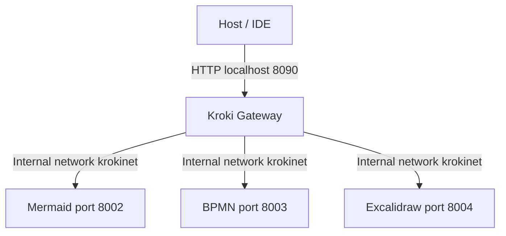

# Kroki Setup

This repository provides a modular **Docker Compose setup** for running a local Kroki server with optional diagram backends (Mermaid, BPMN, Excalidraw, Diagrams.net). It is designed for IDE plugins, Markdown previewers, or any local workflow that benefits from rendering diagrams via Kroki.

## Objectives

* Run Kroki locally as a **single gateway** for multiple diagram types.
* Allow modular, **optional backends** (Mermaid, BPMN, Excalidraw, Diagrams.net).
* Enable host access to Kroki via a **single port**, while backends remain internal.
* Keep configuration **DRY and composable**, supporting multiple diagrams without duplication.

## Architecture Overview

```mermaid
flowchart TD
    HostIDE[Host / IDE] -->|HTTP: localhost:8090| Kroki[Kroki Gateway]
    Kroki -->|Internal network (krokinet)| Mermaid[Mermaid :8002]
    Kroki -->|Internal network (krokinet)| BPMN[BPMN :8003]
    Kroki -->|Internal network (krokinet)| Excalidraw[Excalidraw :8004]
```

* **Host access** → only Kroki (`8090`) is exposed externally.
* **Internal communication** → backends (`expose`) are reachable only by Kroki.
* **Network isolation** → all services on `krokinet`.

## Compose Extension Mechanism

We use **Docker Compose `extends`** to layer configuration:

* `compose.yaml` → defines **bare Kroki** (gateway, port, network, tmpfs).
* `compose.<feature>.yaml` → defines optional backend and **augments Kroki**:

  * Adds `depends_on` for the backend
  * Adds environment variables pointing Kroki to the backend (`KROKI_<SERVICE>_HOST`)

This allows you to **run Kroki with only the services you need**, e.g., Mermaid only, Excalidraw only, or both.

## Usage
The package provides convenience scripts defined in the package `project.json`. For customization it may be preferable to work directly with `docker compose`:

### Run Kroki only

```bash
docker compose -f compose.yaml up -d
```
### Run Kroki + Mermaid

```bash
docker compose -f docker/compose.mermaid.yaml up -d
```

### Run Kroki + multiple backends

```bash
docker compose -f docker/compose.commons.yaml \
               -f docker/compose.mermaid.yaml \
               -f docker/compose.excalidraw.yaml up -d
```

## File Overview

* `compose.commons.yaml` → base Kroki service and network.
* `compose.mermaid.yaml` → adds Mermaid backend.
* `compose.excalidraw.yaml` → adds Excalidraw backend.
* (Add additional `compose.<feature>.yaml` as needed.)

## Appendix: Compose Syntax Caveats

1. **Environment Variables Merge Behavior**

   * `environment` as a **list** (`- KEY=value`) is **replaced** when merging.
   * `environment` as a **map** (`KEY: value`) is **merged key-by-key**, which is what you want for modular setups.

2. **`extends` Limitations**

   * Works per service, not per file.
   * Stacking multiple `extends` on the same service can overwrite environment variables unexpectedly.
   * Recommended pattern: base service in `compose.commons.yaml`, optional backends in feature-specific files that extend Kroki individually.

3. **`ports` vs `expose`**

   * Use `ports` for host access (only Kroki needs this).
   * Use `expose` for backends; Kroki communicates internally via Docker network.

4. **`container_name`**

   * Avoid using fixed container names for composable setups; they can cause collisions if scaling or running multiple stacks.

## Network

All services share a dedicated network `krokinet`:

```yaml
networks:
  krokinet:
    name: krokinet
```

This ensures internal service discovery works consistently.

Would you like me to also **update the “flow of requests” diagram in Mermaid** to show how Markdown previewers/IDE plugins talk to Kroki and get diagrams rendered? That can make it really intuitive for users.

## Diagram 



# Kroki Container Images
Kroki exposes a set of given and optional services distributed over multiple containers. The main or given `kroki` container provides:

  - yuzutech/kroki
    - ActDiag
    - BlockDiag
    - Bytefield
    - D2
    - Ditaa
    - Erd
    - GraphViz
    - Nomnoml
    - NwDiag
    - PacketDiag
    - Pikchr
    - PlantUML including C4 model
    - RackDiag
    - SeqDiag
    - Structurizr
    - Svgbob
    - Symbolator
    - UMlet
    - Vega
    - Vega-Lite
    - WaveDrom
    - WireViz

The optional containers provide additional diagram types:

- yuzutech/kroki-bpmn
  - BPMN
- yuzutech/kroki-excalidraw
  - Excalidraw
- yuzutech/kroki-mermaid
  - Mermaid
- yuzutech/kroki-diagramsnet
  - DiagramsNet (diagrams.net)